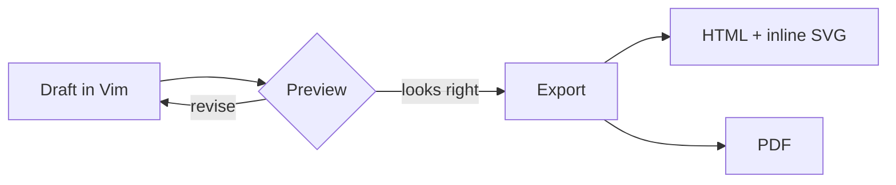

# A field guide to mdview

This document exercises the renderer with **Markdown**, local structure, code, and a live Mermaid diagram.

> Good documents make complex systems easier to inspect.

## Release path



## Readiness

- [x] Render Markdown
- [x] Draw Mermaid diagrams
- [x] Edit with Vim bindings
- [ ] Ship the next document

| Format | Result |
| --- | --- |
| Markdown | Live, sanitised preview |
| Mermaid | Responsive SVG |
| HTML | Standalone rendered document |
| PDF | Platform-quality print output |

## Code

```ts
const document = await open("notes.md");
render(document, { diagrams: "svg" });
```

---

External links open in the system browser: [Tauri](https://tauri.app/).
